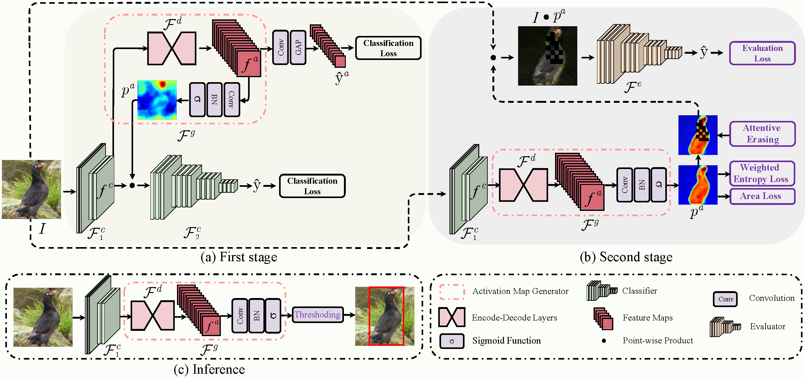

# ORNet

Code repository for our
paper "[Online Refinement of Low-level Feature Based Activation Map for Weakly Supervised Object Localization](https://arxiv.org/abs/2110.05741)"
in ICCV 2021 (*Poster Presentation*).



The repository includes full training, evaluation, and visualization codes
for [CUB-200-2011](http://www.vision.caltech.edu/visipedia/CUB-200.html)
and [ILSVRC2012](https://image-net.org/challenges/LSVRC/2012/) datasets.

## Dependencies

* Python 3
* Pytorch 1.0.0+
* OpenCV-Python
* Numpy
* Scipy
* MatplotLib
* Yaml
* Easydict

## Dataset

### CUB-200-2011

You will need to download the images (JPEG format) in CUB-200-2011 dataset
at [here](http://www.vision.caltech.edu/visipedia/CUB-200.html). Make sure your ```data/CUB_200_2011``` folder is structured as
follows:

```
├── CUB_200_2011/
|   ├── images
|   ├── images.txt
|   ├── bounding_boxes.txt
|   ...
|   └── train_test_split.txt
```

You will need to download the images (JPEG format) in ILSVRC2012 dataset at [here](https://image-net.org/challenges/LSVRC/2012/).
Make sure your ```data/ILSVRC2012``` folder is structured as follows:

### ILSVRC2012

```
├── ILSVRC2012/
|   ├── train
|   ├── val
|   ├── val_boxes
|   |   ├——val
|   |   |   ├—— ILSVRC2012_val_00050000.xml
|   |   |   ├—— ...
|   ├── train.txt
|   └── val.txt
```

## Training

Training (You can specify the desired settings in config/CUB_200_2011.yaml and config/ILSVRC2012.yaml, e.g., the data
root):

### On CUB-200-2011 dataset

Download the pretrained checkpoints at [here](https://drive.google.com/file/d/1W9f8Jy0m-SOurvU1sFLvp4--xIKCvpzB/view) and put them in the directory of debug/checkpoints/

```
├── debug/
|   ├── images
|   ├—— checkpoints
|   |   ├—— evaluator
|   |   ├—— cub_coarse_best_model
|   |   ├—— cub_fine_best_model
|   └── logs

```

Train the model

```sh
OMP_NUM_THREADS=16 CUDA_VISIBLE_DEVICES=0 python train_2nd_step.py --cfg config/CUB_200_2011.yaml --experiment cub_fine_model
```

The code will create experiment folders for model checkpoints (./debug/checkpoint), log files (./debug/log) and
visualization (./debug/images/).

```
├── debug/
|   ├── checkpoints
|   ├—— images
|   |   ├—— cub_fine_model
|   |   |   ├—— train
|   |   |   ├—— test
|   |   ├—— ...
|   └── logs
```

use the last checkpoint for evaluation of second stage

```sh
OMP_NUM_THREADS=16 CUDA_VISIBLE_DEVICES=0 python train_2nd_step.py --cfg config/CUB_200_2011.yaml --experiment cub_fine_model --evaluate True
```

To reproduce the evaluation results presented in the paper.

```shell
OMP_NUM_THREADS=16 CUDA_VISIBLE_DEVICES=0 python train_2nd_step.py --cfg config/CUB_200_2011.yaml --experiment cub_fine_best_model --evaluate True
```

### On ILSVRC2012 dataset (TODO)

## Reference

If you are using our code, please consider citing our paper.

```
@InProceedings{Xie_2021_ICCV,
    author    = {Xie, Jinheng and Luo, Cheng and Zhu, Xiangping and Jin, Ziqi and Lu, Weizeng and Shen, Linlin},
    title     = {Online Refinement of Low-Level Feature Based Activation Map for Weakly Supervised Object Localization},
    booktitle = {Proceedings of the IEEE/CVF International Conference on Computer Vision (ICCV)},
    month     = {October},
    year      = {2021},
    pages     = {132-141}
}
```
